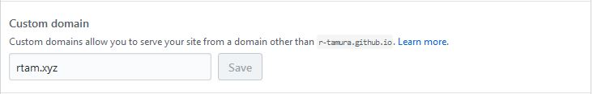

Gatsbyを使って静的WebサイトをMarkdownで作成し、CircleCI経由でGitHub Pagesにデプロイ。GitHub Pagesはカスタムドメインを設定し、Cloudflare経由でSSLアクセスを可能にする。

# 手順

## Gatsbyの導入

Coming...


## カスタムドメインの取得

[お名前.com](http://www.onamae.com/)にて取得

 - ドメイン名: `rtam.xyz`
 - WHOIS情報: お名前.comに委譲

## CircleCI経由でのデプロイ

CircleCIの設定ファイル`circle.yml`にデプロイ用設定を入力
```yml circle.yml
machine:
  node:
    version: 7.9.0
test:
  override:
    - echo "skip test..."
deployment:
  production:
    branch: master
    commands:
      - git config --global user.name "CircleCI"
      - git config --global user.email "rtamura30@gmail.com"
      - npm run clean
      - npm run deploy
```

デプロイ先のレポジトリへのDeploy keyがないので、作成してGitHub側に公開鍵, CircleCI側に秘密鍵を登録する

### 鍵の作成
rd_rsa, rd_rsa.pubを生成する

```bash
// RSA / 2048bit / コメントなし / パスフレーズもなし
$ ssh-keygen -t rsa -b 2048 -C ''
Enter passphrase (empty for no passphrase):
Enter same passphrase again:
```

### 秘密鍵をCircleへ登録
Circle CIダッシュボード > PROJECTS > [ブログプロジェクト] > 右上の歯車マークの設定ボタン > SSH Permissions > Add SSH Key

```
Hostname: github.com
Private Key: id_rsaのテキスト
```

上記内容を入力して、Add SSH Keyを選択

### 公開鍵をGitHubへ登録

**[デプロイ先プロジェクト]** > Settings > Deploy keys > Add deploy key

```
Title: 任意
Key: id_rsa.pubのテキスト
Allow write access: チェックする
```
上記内容で設定し、Add keyを選択


## Cloudflare設定

### Cloudflareアカウント登録

[Cloudflare](https://www.cloudflare.com/) > Sign up > アカウント情報入力 > Create Account

### DNS設定

#### ドメイン名スキャン
`rtam.xyz`をテキストボックスに入力して[Scan DNS Records]でスキャンを開始する(1分弱かかる)

#### DNS設定

設定属性| 設定値
-------|---------------------
 Type  | A
 Name  | rtam.xyz
 Value | 192.30.252.153, 192.30.252.154
 TTL   | Automatic


>Follow your DNS provider's instructions to create two A records that point your custom domain to the following IP addresses:
>
> 192.30.252.153
> 192.30.252.154

[Configuring A records with your DNS provider](https://help.github.com/articles/setting-up-an-apex-domain/#configuring-a-records-with-your-dns-provider)に記載されているIPを登録する

上記設定後、Continueを選択

※GitHubのレポジトリ設定画面で`Custom domain`にカスタムドメインが設定されていることを確認する



#### Cloudflareプラン設定

 無料のFree Websiteを設定 > Continueを選択

#### ネームサーバの確認

Cloudflareが用意するネームサーバが2つあることを確認し、メモする(次に、DNSレジストラ側でそのDNSサーバを設定するため) > Continueを選択

### ドメインレジストラのDNSサーバ設定をCloudflareのDNSに設定

お名前.comへアクセス > ログイン > 取得したドメインのネームサーバ > 他のネームサーバを利用 > Cloudflareで確認したネームサーバを登録


### CloudflareでSSL設定

#### SSL

```
SSL: Frexible
```

これによりClient <=> Cloudflare 間はHTTPS, Cloudflare <=> GitHub 間はHTTPとなる
GitHubにカスタムドメインの証明書を登録できないためa

#### HTTP Strict Transport Security (HSTS)

設定属性| 設定値
-------|---------------------
Status | On
Max-Age | 6 months (recommended)
Include subdomains | On
Preload | On
No-sniff | On


#### Automatic HTTPS Rewrites

ONに設定する

# 参考
 - [Adding read/write deployment key](https://circleci.com/docs/1.0/adding-read-write-deployment-key/) Deploy keyの登録方法
 - [CloudflareでブログをHTTPS化](https://www.kaitoy.xyz/2016/07/01/https-support-by-cloudflare/)
 - [カスタムドメインの GitHub Pages で HTTPS を使う](http://qiita.com/superbrothers/items/95e5723e9bd320094537)
 - [Configuring A records with your DNS provider](https://help.github.com/articles/setting-up-an-apex-domain/#configuring-a-records-with-your-dns-provider)
 - [Setting up a custom subdomain](https://help.github.com/articles/setting-up-a-custom-subdomain/)
