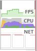
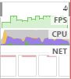

ブラウザがHTMLをレンダリングする際に何を行っているか

## The pixel pipeline
---

ブラウザがレンダリングをする際に行っていることは、大きく分けると次の5つになる: 


 - **JavaScript**: DOM操作で画面の見た目を変更にかかわるスクリプトの処理。
 - **Style**: 要素に対してどのCSSルールが適用されているかを計算するプロセス。
   `.class1`や`.class2`のように複数CSSセレクタが該当するものは、CSS適用の優先度から最終的にあてはまるルールを決定する。
 - **Layout**: 位置, 幅, 高さなど、要素がスクリーンのどのスペースを占めるかを決定するプロセス。Firefoxでは`reflow`と呼ばれる。
   `width`, `height`, `left`, `top` を変更するとLayout処理が発生する。
 - **Paint**: 描画処理呼び出しリストの作成と要素ピクセルに色で埋める処理(ラスタライズ)を行う。
   テキスト、色、画像、ボーダー、影を描画する処理を含む。
   `color`, `background-color`や`border-radius`, `border`, `box-shadow`などを変更するとPaintの処理が発生する。
 - **Composite**: ブラウザは複数のレイヤ(*1)と呼ばれる単位で描画されている。ページ全体にレイヤが正しい順序で描画を行うプロセス。
   `transform`, `opacity`の変更はこのプロセスのみを発生させる。

再描画の際に実行されるプロセスが少ないほど高速となるので、アニメーションやスクロールなどの高負荷処理の部分では
**Composite**のみを発生させるようチューニングするのが望ましい。

## Side Navigationでパフォーマンス比較
---
Side Navigationをアニメーションで表示させてパフォーマンスの違いを確認する

使用するHTML

```html
  <div class="app">
    <div class="side-menu">side-menu</div>
    <div class="header">
      <button class="menu-button">open</button>
    </div>
  </div>
```

### 1. leftプロパティでアニメーション

```css
.side-menu {
  left: -102%;
  transition: left 150ms linear;
}

.side-menu--open {
  left: -70%;
  transition: left 150ms linear;
}
```

### 2. transformプロパティでアニメーション
`will-change`プロパティでレイヤーを生成している。(非対応ブラウザには`transform: translateZ(0);`)

```css
.side-menu {
  transform: translateX(-102%);
  transition: transform 300ms linear;
  will-change: transform;
}

.side-menu--open {
  transform: translateX(-30%);
  transition: transform 300ms linear;
}
```

## 比較結果
1. leftプロパティでアニメーション  
  

2. transformプロパティでアニメーション  


大幅な差は確認できなかったが、transformプロパティでのアニメーションのほうがFPSが安定していることがわかった。
今回は調査しなかったが`will-change`プロパティはGPUメモリにレイヤを格納し続けるのでスマートフォンなどでは電池消費が大きくなるそうで、
アニメーション直前に`will-change`をオンにするのが良い方法らしい。

---
**\*1 レイヤー**: GPUで処理される領域。GPUへテクスチャとしてアップロードされる。1つのレイヤが大きい場合はより小さいタイルという単位でアップロードされる。

# 参考
 - [Rendering Performance](https://developers.google.com/web/fundamentals/performance/rendering/)
 - [Smooth as Butter: Achieving 60 FPS Animations with CSS3](https://medium.com/outsystems-experts/how-to-achieve-60-fps-animations-with-css3-db7b98610108)
 - [CSS Triggers](https://csstriggers.com/) どのCSSルールがどのプロセスを発生させるか
 - [Chrome Developer Toolsを使いこなそう！](https://www.slideshare.net/yoshikawa_t/chrome-developer-tools-17787728) 
 - [DevToolsのTimelineパネルを見ながら、レンダリングの仕組みを理解する](http://qiita.com/cy-mitsuki/items/51a0a4c17b89154a7af2)
 - [Accelerated Rendering in Chrome](https://www.html5rocks.com/ja/tutorials/speed/layers/) Chromeのレイヤー概念とGPUについて
