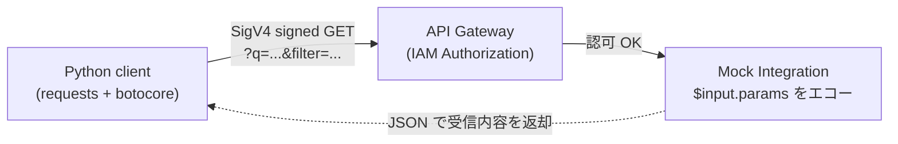

## TL;DR

- **AWS SigV4 の仕様では、クエリ文字列内の空白は `%20` でなければならない (`+` ではダメ)**。
- Python 標準の `urllib.parse.urlencode` は **デフォルトで `quote_plus`** を使うので、空白を `+` に変換する。`urlencode(params)` の戻り値をそのまま URL に貼ると、`SignatureDoesNotMatch` (403) になりうる。
- 解決策は 2 通り:
  1. `urlencode(params, quote_via=quote, safe="")` — `quote` を使い空白を `%20` にする (今回採用した方法)
  2. `AWSRequest(url=..., params=...)` で `params=` キーワードを使い、botocore に正規化を任せる
- **botocore の `urlencode` は Python 標準の再エクスポートで実装は同じ**。違うのは "どの場面で何のオプションで呼ぶか"。

検証用のソースコード一式 (CDK スタック・Python クライアント) は [r-tamura/aws-demo-execute-api-gateway-iam-authorization](https://github.com/r-tamura/aws-demo-execute-api-gateway-iam-authorization) に置いている。v

---

## モチベーション

Python クライアントで `IAM Authorization` を有効にした API Gateway REST API に対して、特定のクエリパラメータ値だと API 側で `403 SignatureDoesNotMatch` で弾かれる事象が出ていた。

問題のコードはこういう作りで、URL の組み立ては `requests.Request.prepare()` に任せ、署名だけ `AWSRequest` + `SigV4Auth` に通していた:

```python
# URLエンコード
prepared = requests.Request(
    method=method,
    url=f"{base_url}{path}",
    params=params,
).prepare()
req = AWSRequest(method=method, url=prepared.url)
# SigV4署名
SigV4Auth(creds, service, region).add_auth(req)
return prepared.url, dict(req.headers)
```

これが、空白を含むクエリ値が入った瞬間に 403 を踏むことが分かった。

原因切り分けの結果、`requests.Request.prepare()` を経由せず、自前で URL のクエリを組み立ててから `AWSRequest` に渡す形に書き換えたら通るようになった:

```python
query = urlencode(params, quote_via=quote, safe="")
url = f"{base_url}{path}?{query}"
req = AWSRequest(method=method, url=url)
SigV4Auth(creds, service, region).add_auth(req)
return url, dict(req.headers)
```

動いたものの、なぜデフォルトの `urlencode(params)` ではダメで、`quote_via=quote, safe=""` だと通るのか。そして `requests.Request.prepare()` の何が SigV4 と相性が悪いのか。これは「呼び出し側で頑張る」のが正しいのか、それとも `boto3`/`botocore` 側でもっと素直に書けるのかが気になった。

API Gateway の Mock 統合で再現環境を立てて、SigV4 + URL エンコードの挙動を実測しながら整理した。

## 構成

検証用に、API Gateway REST API + Mock 統合 + IAM 認可の最小構成を CDK で立てた (Lambda は不要)。Mock 統合の応答テンプレートで `$input.params(...)` をエコーするので、API Gateway 側がパス・クエリをどう受信したかをそのまま観測できる。CDK スタックは [GitHub のリポジトリ](https://github.com/r-tamura/aws-demo-execute-api-gateway-iam-authorization) を参照。



## 原因

URLエンコードで空白文字をどう扱うかの違いによることが原因だった。

### `requests.Request.prepare()` は何をしているか

問題のコードは `params=` キーワードで `requests.Request(...).prepare()` に URL を組み立てさせていた。この経路では `requests` 内部の `PreparedRequest._encode_params` → `urlencode(items, doseq=True)` (= `quote_plus`) が走る。`quote_plus` は `application/x-www-form-urlencoded` 形式で、**空白は `+`** に変換される。

```python
prepared = requests.Request(
    "GET",
    "https://api.example.com/query",
    params={"q": "a b", "filter": "x y"},
).prepare()
print(prepared.url)
# → https://api.example.com/query?q=a+b&filter=x+y
```

### AWS の SigV4 仕様

[AWS の SigV4 仕様 (署名付きリクエストの作成)](https://docs.aws.amazon.com/ja_jp/IAM/latest/UserGuide/reference_sigv-create-signed-request.html) は canonical query string の正規化規則として

> For example, the space character must be encoded as `%20` (not using `'+'`, as some encoding schemes do).

と明記しており、**空白は `%20` 必須** (`+` は不可)。

つまり `requests.Request.prepare()` の `params=` 経路 (form-encoded、空白 `+`) と SigV4 仕様 (空白 `%20`) はズレている。`?q=a+b` の URL を `AWSRequest(url=...)` に渡して `AWSSigV4Auth`で署名(`add_auth`)すると、botocore は URL のクエリをそのままで そのまま署名する (`add_auth` -> `canonical_request` -> [_canonical_query_string_url](https://github.com/boto/botocore/blob/a748cc02/botocore/auth.py#L280-L294))ので、一致しない。

## 動くパターン

調べた結果、安定して動く書き方は 2 通りあった。今回実装したのはパターン 1 だが、パターン 2 のほうが botocore の機能をそのまま利用していて綺麗だと個人的には思う。

### パターン 1: 標準 `urlencode` + `quote` (今回のとった方法)

呼び出し側のレイヤを薄く保ちたい・既存の `requests` ベースのコードに最小変更で済ませたい場合はこれ。

```python {6}
from urllib.parse import urlencode, quote
import requests
from botocore.auth import SigV4Auth
from botocore.awsrequest import AWSRequest

query = urlencode(params, quote_via=quote, safe="")
url = f"{base}?{query}"

req = AWSRequest(method="GET", url=url)
SigV4Auth(creds, "execute-api", region).add_auth(req)
resp = requests.get(url, headers=dict(req.headers), timeout=15)
```

- `quote_via=quote, safe=""` で空白は `%20`、`+` は `%2B`、`/` は `%2F` になる

### パターン 2: botocore に任せる

AWSRequestクラスにも[prepare](https://github.com/boto/botocore/blob/a748cc0255984aa6693f82533b806bc06553fd2e/botocore/awsrequest.py#L479-L481)メソッドがあるのでそれを使うやり方。prepareメソッドは AWSPreparedRequestを返す。

```python {9}
from botocore.auth import SigV4Auth
from botocore.awsrequest import AWSRequest
from botocore.httpsession import URLLib3Session

def call_pattern3(
    signer: SigV4Auth, base_url: str, path: str, params: dict
) -> tuple[str, int, str]:
    req = AWSRequest(method="GET", url=f"{base_url}{path}", params=params)
    signer.add_auth(req)        # ← 署名を先に。params が見える状態で _canonical_query_string_params が走る
    prepared = req.prepare()    # ← その後 prepare で wire URL を組み立て

    resp = URLLib3Session().send(prepared)
    return prepared.url, resp.status_code, resp.text
```

## まとめ

- IAM 認可付き API Gateway を Python から呼ぶときの URL エンコード問題は、SigV4の仕様とPython の `urlencode`や requests.Request.prepare()の違いに注意する。
- パターン2はquote処理をbotocore側に任せられるのでいいと思う。
