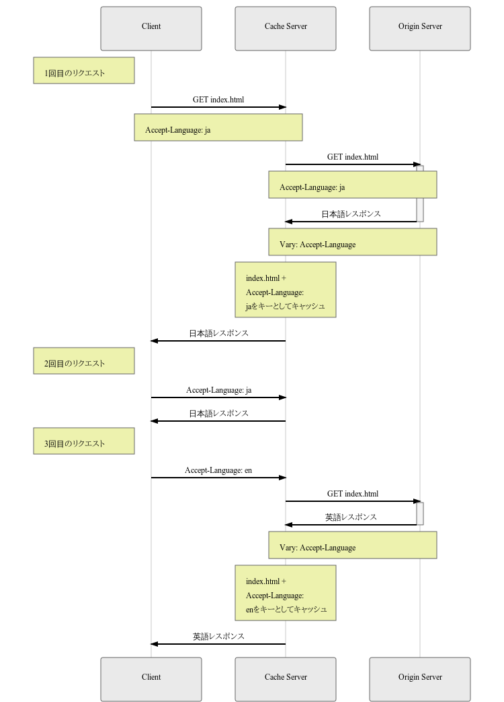

HTTP Varyヘッダとはクライアントとサーバ間(以下 オリジンサーバ)にCDN等のキャッシュサーバへキャッシュの扱い方を指定するためのフィールド。

# 背景と問題
同じURLへのアクセスでもリクエストに含まれるAccept-Languageヘッダによって言語ごとに異なるレスポンスをサーバが返す場合、
キャッシュサーバが**URLのみ**で  「キャッシュを利用するか」/「オリジンサーバへ問い合わせをするか」を判断してしまうと、
Accept-Languageヘッダで指定された言語にオリジンサーバが対応しているにもかかわらず、
キャッシュサーバが間違ったレスポンスを返してしまう可能性がある。これを解決するのが`Vary`フィールド。

# Varyフィールド
**Vary**フィールドは[RFC7231][link1]で定義されている。
以下の図はVaryフィールドを使った異なる言語に対するレスポンスの振り分けの例。  
クライアントから3回リクエストが送信されていますが、Varyフィールドで言語ごとのレスポンスをキャッシュサーバへキャッシュしている。



 - \> 1回目のリクエスト  
キャッシュサーバにキャッシュがない状態ですのでキャッシュサーバからオリジンサーバへ問い合わせが発生する。その際、オリジンサーバは`Vary: Accept-Language`をレスポンスに付加することで、キャッシュサーバはURLだけでなく、URL + `Accept-Language: ja`をキーとしてレスポンスをキャッシュする。

```
Content-Language: ja
Vary: Accept-Language
```

 - \> 2回目のリクエスト  
 キャッシュサーバに`Accept-Language: ja`のリクエストが来ましたが、すでにキャッシュに登録されているためキャッシュのレスポンスをクライアントへ返する。**オリジンサーバへのリクエストは発生しません**。

 - \> 3回目のリクエスト
 `Accept-Language: en`のリクエストが来ましたが、キャッシュサーバにはenのキャッシュはないので、オリジンサーバへ問い合わせ、帰ってきたレスポンスをenでキャッシュして、クライアントへ返する。


 # まとめ
 言語によるレスポンス振り分けにおけるキャッシュサーバのキャッシュ制御についての例を確認しました。Varyフィールドは`Accept-Language`だけでなく、他のフィールド指定や複数のフィールドをカンマで区切って指定することもできる。
 ```
 Vary: Accept-Encoding, Accept-Language
 ```
  
 なお、Varyヘッダではオリジンサーバの対応する形式などをキャッシュサーバへ伝えることができないので、それをできるようにする仕様HTTP Variantsというものも提案されている。  

# 参考
 - [キャッシュサーバの効率を改善するHTTP Variantsという提案仕様 - ASnoKaze blog](http://asnokaze.hatenablog.com/entry/2017/10/01/015550)

[link1]: https://tools.ietf.org/html/rfc7231#section-7.1.4