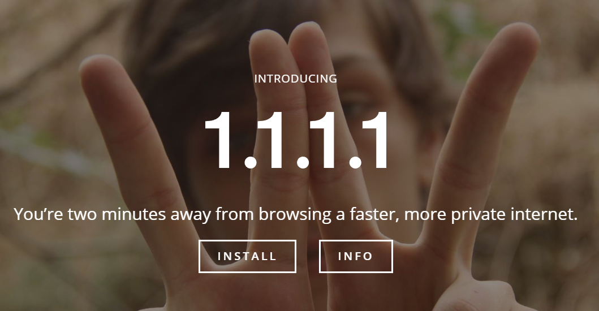
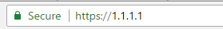
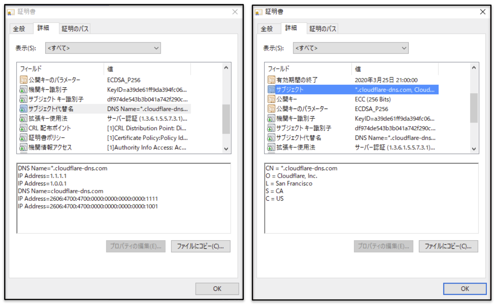
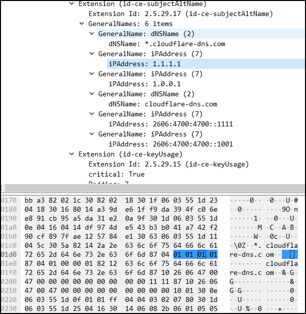

2018/4/1からCDNのCloudflareがIPアドレス`1.1.1.1`をDNSサーバとして運用を開始した。
`1.1.1.1`ではWebサーバも公開されており、アクセスしてみた際にドメインではなくで https://1.1.1.1 という**IPアドレスでSSL接続していた**ことに疑問を覚えたので仕組みを調べてみた。




# 証明書の中身を確認
CN, SANで`1.1.1.1`という値が指定されているはずと考えられるので、まずはブラウザから証明書の中身を確認してみる。



SANのところで`IP Address=1.1.1.1`という項目があり、他にも`1.0.0.1`やIPv6形式のアドレスもあることがわかる。
確かに証明書の中にはIPアドレスで指定されているようだ。そこで、実際に証明書の仕様を確認してみる。

# RFC仕様
[RFC5280][rfc5280]のSANの構造を見てみると以下のようになっている。

```
  SubjectAltName ::= GeneralNames

  GeneralNames ::= SEQUENCE SIZE (1..MAX) OF GeneralName

  GeneralName ::= CHOICE {  
    otherName                       [0]     OtherName,  
    rfc822Name                      [1]     IA5String,  
    dNSName                         [2]     IA5String,  
    x400Address                     [3]     ORAddress,  
    directoryName                   [4]     Name,  
    ediPartyName                    [5]     EDIPartyName,  
    uniformResourceIdentifier       [6]     IA5String,  
    iPAddress                       [7]     OCTET STRING,  
    registeredID                    [8]     OBJECT IDENTIFIER 
  }  
```
SANには[7]で**IPアドレス**も指定できることがわかる。他にもいろいろなものが指定できることも確認できる。仕様がわかったので、次はパケットの中身をみてみる。

# パケットキャプチャをしてみる
WiresharkでSSLハンドシェイク時のパケットをキャプチャし、サーバからのレスポンスCertificateのSAN部分のバイナリデータとWireshark上で見える内容を確認してみる。



バイナリ部分の`87 04`が何を意味しているはわからないが、IPアドレスがオクテット形式でデーター多として見える。

# まとめ
SSL証明書のサブジェクトにIPアドレスが使えることが分かった。今回はRFCを読み、実際にパケットをキャプチャしてみることで仕組みを理解することができた。インターネット上の仕様はいろいろなサイトで解説されているが、全てがRFCを元としているので、わからないことがあったら今後はRFCまで調査するように心がけていきたい。


# 参考
 - [Announcing 1.1.1.1: the fastest, privacy-first consumer DNS service](https://blog.cloudflare.com/announcing-1111/)

[rfc5280][https://tools.ietf.org/html/rfc5280#section-4.2.1.6]