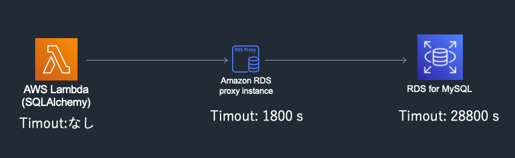

Lambda (Python + SQLAlchemy) + RDS Proxy + RDS for MySQL 環境でデータベースコネクションプールが関連してデータベースに接続できなくなる問題に遭遇したので、理解できた問題点と対応策について書いていく。
今回のエラーを再現するのに必要な最低限の環境 Github 上にあげておく。

- https://github.com/r-tamura/lambda-connection-pool

## コネクションプールとは

> コネクションプーリングとは、データベースにコネクション（接続）する場合に、要求されるたびにコネクションを作成するのではなく、コネクションをプール（保持）して再利用するという機能です。
> このため、コネクションプーリングを使用することにより、同一ユーザからのアプリケーションからデータベースへコネクションする回数が軽減し、データベースへのコネクションを確立するアプリケーションの負荷も軽減されます。

参考: https://software.fujitsu.com/jp/manual/manualfiles/M100004/B1WS0331/06Z201/B0331-01-04-04-01.html

アプリケーションがデータベースとの**コネクションをキャッシュ**することで、DB とのコネクションハンドシェイクをスキップでき、アプリケーションのパフォーマンスを向上させることができる。データベース側にとってもコネクションを大量に維持しなくてよくなりメモリの使用を抑えることができる。

## RDS Proxy

Lambda のようなサーバレスな環境は Web のリクエストを捌いたらすぐに環境が消えるので、従来の常に稼働しているサーバからの DB へのアクセスと比べるとコネクションの数が多くなる性質を持つ。
RDS Proxy はこのような問題を解決するためのサービスで、アプリケーションとデータベースの間でコネクションを管理・再利用してくれる。

> 最新のサーバーレスアーキテクチャに構築されたアプリケーションなどのアプリケーションの多くは、データベースサーバーへの接続を多数開くことができます。このとき、データベース接続の開閉が高頻度で実行されて、データベースメモリやコンピューティングリソースを消耗する可能性があります。Amazon RDS プロキシでは、アプリケーションがデータベースと確立した接続をプールおよび共有でき、データベースの効率とアプリケーションのスケーラビリティが向上します。


- https://aws.amazon.com/jp/rds/proxy/

## エラー内容

> (pymysql.err.OperationalError) (2013, 'Lost connection to MySQL server during query')

データベースサーバとのコネクションが切れてしまっている。

## 問題が起きたときの構成



各登場人物はアプケーション(Lambda), RDS Proxy, データベース(RDS)で、コネクションタイムアウトは

|              | タイムアウト  |
| ------------ | ------------- |
| アプリ       | なし          |
| RDS Proxy    | 30 分 [1][1]  |
| データベース | 8 時間 [2][2] |

Lambda の設定として[Provisioned Concurrency](https://aws.amazon.com/jp/blogs/aws/new-provisioned-concurrency-for-lambda-functions/)という Lambda のコールドスタート対策の機能を利用していた。
また、エラーが確認されたのは開発環境で、アクセスはあまり頻繁にはなかった。

[1]: https://docs.aws.amazon.com/AmazonRDS/latest/AuroraUserGuide/rds-proxy.html
[2]: https://aws.amazon.com/jp/blogs/news/best-practices-for-configuring-parameters-for-amazon-rds-for-mysql-part-3-parameters-related-to-security-operational-manageability-and-connectivity-timeout/

### 原因

なぜコネクションエラーが起こっているかというと、コネクションプール SQLAlchemy で管理されているコネクションプールのタイムアウト時間が、RDS Proxy で管理されているコネクションプールのタイムアウト時間より長いため、SQLAlchemy 上ではまだ使えると思っているコネクションがすでに破棄されていし待っているからだと思う。デフォルトなら、Lambda 関数実行されないと環境が削除され、コネクションプールもなくなるので起きにくいはずだが、Provisioned Concurrency を利用していたため特定の Lambda 環境がすぐに削除されずコネクションプールが維持されているため、問題が顕在化したと考えられる。今回のエラーが発生するときに起こっていることをまとめると以下になるはず。

#### 1. Lambda から最初のアクセス

SQLAlchemy が RDS Proxy へのコネクションを張り、コネクションプールにそのコネクションが追加される。
RDS Proxy は RDS へ新しいコネクションを張り、RDS Proxy のコネクションプールにコネクションが追加される。

#### 2. RDS Proxy の*Idle client connection timeout*時間経過後

RDS Proxy が RDS へのコネクションをコネクションプールから破棄する。

#### 3. Lambda からの 2 度目のアクセス(RDS Proxy の*Idle client connection timeout*以上の時間経過後)

SQLAlchemy がメモリ内に持つコネクションプールからコネクションを取得、そのコネクションに対して SQL を実行する。
RDS Proxy ではすでにコネクションが破棄されているため、エラーが発生する。

### 対応策

今回のエラーを解消するための対応として、いろいろ方法を考えてみた。

#### コネクションプールを利用しない

SQLAlchemy の [create_engine](https://docs.sqlalchemy.org/en/14/core/engines.html#sqlalchemy.create_engine.params.poolclass) の引数に `poolclass` というオプションを設定することができ、このオプションでコネクションプールのロジックを変更することができる。ここに[NullPool](https://docs.sqlalchemy.org/en/14/core/pooling.html#sqlalchemy.pool.NullPool)というコネクションプーリングをしないクラスを指定することでコネクションプールを無効化する。[MySQL のハンドシェイク](https://dev.mysql.com/doc/internals/en/ssl-handshake.html)(と TCP ハンドシェイクも(?))を毎回行うためパフォーマンスはあまり良くないはず。

```python
import sqlalchemy

sqlalchemy.create_engine(
  "mysql+pymysql://user:pw@host/db",
  poolclass=sqlalchemy.pool.NullPool
)
```

参考: [Switching Pool Implementations](https://docs.sqlalchemy.org/en/14/core/pooling.html#switching-pool-implementations)

#### RDS Proxy のタイムアウトより短いタイムアウト時間を SQLAlchemy に設定する

SQLAlchemy のコネクションプールは[デフォルトではタイムアウトしない](https://docs.sqlalchemy.org/en/14/core/engines.html#sqlalchemy.create_engine.params.pool_recycle)。[create_engine のオプション 'pool_recycle'](https://docs.sqlalchemy.org/en/14/core/engines.html#sqlalchemy.create_engine.params.pool_recycle)でタイムアウトを指定することができる。データベース側のタイムアウト値をアプリケーション側できにする必要がある。

```python
import sqlalchemy

sqlalchemy.create_engine(
  "mysql+pymysql://user:pw@host/db",
  pool_recycle=600 # RDS Proxyのタイムアウトより短ければよい
)
```

#### SQL 実行時に接続確認をするようにする

実際に SQL を実行する前にコネクションが有効かをチェックする、いわゆる[悲観的な方法](https://docs.sqlalchemy.org/en/14/core/pooling.html#disconnect-handling-pessimistic)。これも、[create\_\*engine のオプション 'pool_pre_ping'](https://docs.sqlalchemy.org/en/14/core/engines.html#sqlalchemy.create_engine.params.pool_pre_ping)で設定することができる。デフォルトは無効。毎回接続確認のため、DB へアクセスするのでパフォーマンスへの影響はあると思う。タイムアウトを手動で設定しなくてよいので、データベース側のタイムアウト値をアプリケーションが気にしなくて良くなる。

```python
import sqlalchemy

sqlalchemy.create_engine(
  "mysql+pymysql://user:pw@host/db",
  pool_pre_ping=True
)
```

### 最終的に選んだもの

最初は Lambda はステートレスにするのが良いかなと思っていたのでコネクションプールをアプリケーション側で持たない方法を採用しようと思っていたが、[Lambda のベストプラクティス](https://docs.aws.amazon.com/whitepapers/latest/serverless-architectures-lambda/optimizing-your-code.html)にはこのように書かれている。

> Keep alive and reuse connections (HTTP, database, etc.) that were established during a previous invocation.

データベースの接続は使い回すようにするべしとのことなので、アプリケーション側でもコネクションプールを持つ方法の中から選ぶことになる。現状のプログラムの書かれ方などに依存するところではあるが、ひとまず RDS Proxy 側のコネクションプールより短いタイムアウトを設定する方法を使ってみることにして、今後、運用上の問題になってきたら他の方法も検討してみようと思う。
